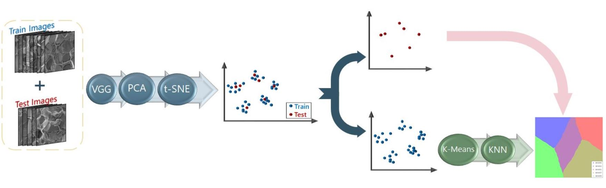

# Clustering and Classification Unsupervised ML algorithms - Visualization of Activation Maps

The main objective of this repository is to present Unsupervised ML data pipelines that enable the clustering and the classification of SEM fracture images of WHA samples, according to their tungsten composition. Additionally, aiming to interpret the functionality of these algorithms and acquire better understanding of the internal operations that enable the efficacy of the algorithms, another algorithm that visualizes the activation maps of the last convolution layer, according to their importance on the data pipelines, is developed.

The theoretical framework and the results of our research work are publically available in the open source publication: 

The dataset that is used to evaluate the performance of the introduced algorithms is composed by 810 SEM fracture images with dimensions: 448x448. The SEM images are obtained after scanning the fracture surface of 5 different WHA samples with tungsten composition of: 90wt%, 92wt%, 95wt%, 97wt% and 99wt%. 

The entire WHA dataset and the corresponding Activation Maps are published in Materials Data Facility (MDF) with DOI: 

## Clustering Data Pipeline

The main structure of the Clustering Data Pipeline is composed by 4 consecutive parts, where the output of each part is the input of the next (see the schematic flowchart of the pipeline in the figure below). 

More specifically, the functionality of each stage is defined as follows:

1. **VGG16**: the VGG16 neural network architecture (Simonyan and Zisserman, 2014), where the final Fully-Connected layers are replaced by a Global Average Pooling (GAP) layer, is used to extract features from the input SEM fracture images. The network, using a set of pre-trained weights on the ImageNet dataset (Russakovsky et al., 2015), performs predictions on the SEM images. Each fracture image of the dataset is imported into the network and, after passing through all the consecutive layers, the last convolution layer outputs a sequence of 512
two-dimensional feature maps for each image. The GAP layer at the end of the network computes the mean value for each feature map and exports an 512-dimensional feature vector for each input image. This modiffied network architecture enables the extraction of 512 features from each input image. Thus, a set of weights, although being trained on an extensive dataset of images that have no relevance
to fracture images, when loaded to the modied VGG16 architecture allows the network to reduce the dimensionality of the input images from 224 x 224 to 512 dimensions and extract meaningful information from the input data; the fracture images were resized to 224  224, before inserted into VGG.
2. **PCA**: a Principal Component Analysis (Karl Pearson F.R.S., 1901) on the feature vectors extracted by VGG allows the computation of the 50 principal components that maximize the total variance of the data. This linear-dimensionality reduction algorithm expresses each feature vector, which corresponds to a certain fracture image, with respect to 50 principal axes that maximize the total variance of the data. The algorithm enables the estimation of the "importance" of each principal component, by computing the eigenvalues of the covariance matrix of the set of feature vectors and furthermore the computation of the weight that each feature extracted by VGG has on each principal axis, by computing the eigenvectors of the covariance matrix.
 3. **t-SNE**: this algorithm (van der Maaten and Hinton, 2008) performs a non-linear dimensionality reduction on the set of 50-dimensional feature vectors that is exported by PCA. It computes similarities between the data points in the 50-dimensional space and projects them onto the 2D space, according to these similarities. The final output of this stage is a 2D plot. By the end of this third part, the pipeline achieves to project the initial fracture images dataset onto data points on a 2D plot, in positions that enable clustering according to similarities of the fracture images.
4. **k-Means**: the k-Means algorithm (Lloyd, 1982) groups the data points, exported by t-SNE into 5 clusters, according to their Euclidean distances in the 2D space. As a result, k-Means assigns a label to each data point according to the cluster that it belongs.
