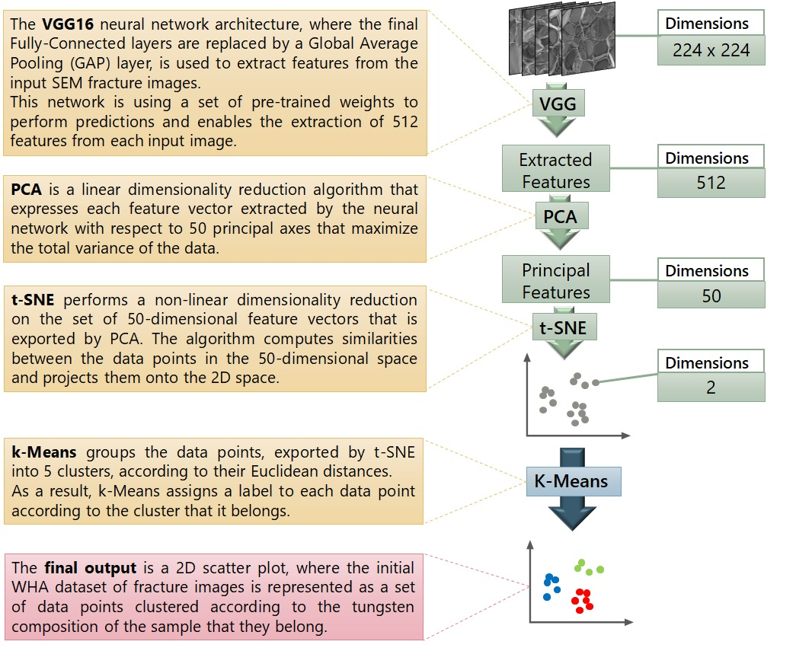
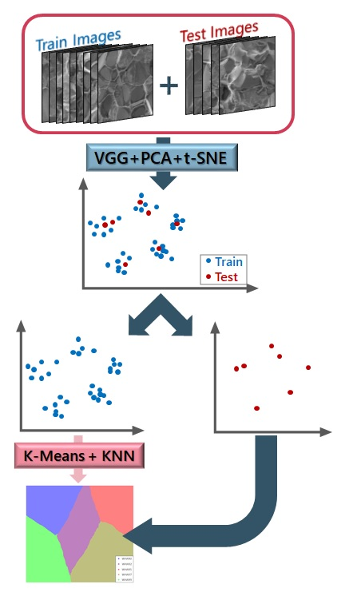
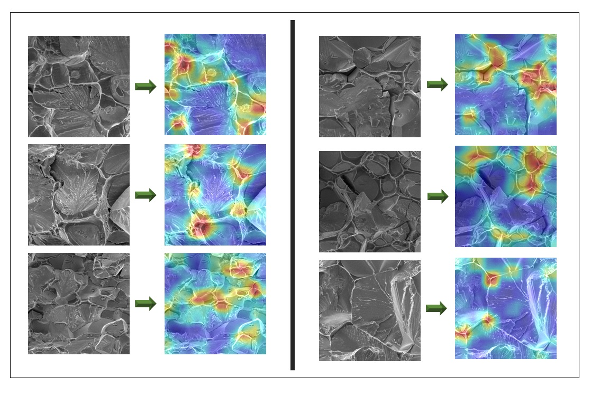

# Clustering and Classification Unsupervised ML algorithms - Visualization of Activation Maps

This repository presents the computer algorithms developed for the open source publication: *"Unsupervised Machine Learning in Fractography: Evaluation and Interpretation"*

The main objective of this repository is to present Unsupervised ML data pipelines that enable the clustering and the classification of SEM fracture images of WHA samples, according to their tungsten composition. Additionally, aiming to interpret the functionality of these algorithms and acquire better understanding of the internal operations that enable the efficacy of the algorithms, another algorithm that visualizes the activation maps of the last convolution layer, according to their importance on the data pipelines, is developed.

The dataset that is used to evaluate the performance of the introduced algorithms is composed by 810 SEM fracture images with dimensions: 448 x 448. The SEM images are obtained after scanning the fracture surface of 5 different WHA samples with tungsten composition of: 90wt%, 92wt%, 95wt%, 97wt% and 99wt%. 

The entire WHA dataset and the corresponding Activation Maps are published in Materials Data Facility (MDF) with DOI: https://doi.org/10.18126/aph0-olbz

The source code of the Clustering and Classification algorithms builds upon the code published at [neu_vgg16](https://github.com/arkitahara/neu_vgg16) by [Andrew Kitahara](https://github.com/arkitahara).

## Clustering Data Pipeline

The main structure of the Clustering Data Pipeline is composed by 4 consecutive parts, where the output of each part is the input of the next (see the schematic flowchart of the pipeline in the figure below). 

  

## Classification Data Pipeline

Adding a *minimally supervision* algorithm at the end of the clustering pipeline and defining a different computational framework the previous data pipeline is converted to a classification algorithm that enables the classification of the input fracture images according to the tungsten composition. The structure of this classification algorithm and the definition of its computational framework is schematically presented in the mext figure.

  

The computational framework is composed of the following steps:

1. In the WHA fracture images dataset define a train and a test sub-set.
2. Insert the entire WHA dataset into the **VGG + PCA + t-SNE** pipeline. The resulted 2D scatter plot is separated into a **train plot** and a **test plot**.
3. The training data points are imported into a **k-Means + k-Nearest Neighbors** pipeline.
4. Create a mesh grid with dimensions large enough to accommodate every training and test data point. Implementing the  **k-Nearest Neighbors** algorithm enables the classification of every grid point into one of the 5 tungsten composition labels. A colormap, where each area is assigned to a different tungsten composition label is produced.
5. Finally, plot the test data points, with the positions predicted by the **VGG + PCA + t-SNE** pipeline, onto the colormap.

## Visualization of the Activation Maps

The objective of the Visualization.py algorithm is to identify the specific locations in the input WHA fracture images that accomondate the features that the Clustering pipeline activates in order to cluster the fracture images according to the tungsten composition. 

To this end, the weighted sum of the activation maps exported by the last convolution layer of the VGG16 architecture (*"block5conv3"*) for each input image is computed. The weights of this summation are defined by the coefficients of the eigenvector that corresponds to the first Principal Component of the PCA. Summing the activation maps of this layer according to the importance of the corresponding features to the dimensionality reduction aldorithms of the clustering pipeline enables the identification of the features that the algorithm is identifying and consequently bases its efficient clustering of the WHA fracture images dataset.

The next figure presents some representative activation maps computed for different fracture images of the dataset:

  

## Prerequisites

- Numpy
- Matplotlib
- Opencv for Python
- Keras
- Tensorflow
- Scikit-learn
